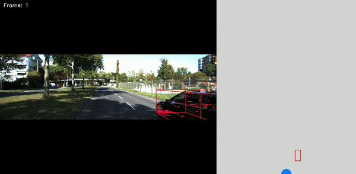

# YOLO-LiDAR Fusion
## 1. Overview
This repository contains the code produced during my Master's Thesis in collaboration with the UBIX research group of the University of Luxembourg’s Interdisciplinary Centre for Security, Reliability, and Trust (SnT).
This thesis aimed to develop a resource-efficient model for 3D object detection utilizing LiDAR and camera sensors, tailored for autonomous vehicles with limited computational resources. An overview of the model is shown in the figure below.




## 2. Prerequisites
### Hardware
- Ideally: NVIDIA GPU such that the YOLOv8 model can be run with CUDA

_Note:_ The model can also be run on the CPU (slower). 

### Software
- Python version between 3.8 and 3.11 (due to open3d requirements)

_Note:_ The code was developed and tested on Python 3.10. 

## 3. Setup
Follow the steps below to set up the environment:

1. Go to the directory of your choice and clone the repository:

    ```shell
    git clone https://github.com/TimKie/YOLO-LiDAR-Fusion.git
    ```

2. Get into the working directory (root directory of the repository):

    ```shell
    cd YOLO-LiDAR-Fusion
    ```

3. Optionally create and start a virtual environment:

    ```python
    python -m venv venv
    source venv/bin/activate
    ```

4. Install required libraries:

    ```python
    pip install -r requirements.txt
    ```

## 4. Usage
Follow the steps below to use the model:

_Note:_ Make sure that the file structure is as stated below in [File Structure](#6-file-structure). 

1. Go to the directory where the implementation is located:

   ```shell
   cd Code
   ```

2. The simplest command to process a single frame from the **KITTI_dataset** directory is as follows (where _image_index_ is a 6-digit number between '000000' and '007517'). This will display the processed frame as well as the ground truth (GT) bounding boxes (labels) of KITTI and print the best and average IoU scores between the predicted and GT bounding boxes for each object class in the frame:

   ```shell
   python main.py image_index
   ```

3. Some optional parameters that can be specified in the command are shown below:

   ```shell
   python main.py image_index --mode --model-size --erosion --depth --pca --dataset-path --output-path
   ```

   The parameters can take the following values:
   - **image_index**:
      - number of the image (between '000000' and '007517')
      - 'random' for multiple random images
      - 'evaluation' to process the complete dataset
      - 'video' to process raw data and create a processed video
    
   - **--mode**:
      - detect (model only detects objects) (default)
      - track (model detects and tracks objects)
    
   - **--model-size**: specifies the YOLOv8 model size that is used (n, s, m, l, x) (default: m)
     
   - **--erosion**: specifies the amount of erosion used by the model (smaller value --> higher erosion) (default: 25)
   
   - **--depth**: specifies the depth filter factor used by the model (smaller value --> more aggressive filtering) (default: 20)
  
   - **--pca**: specifies whether PCA should be used to create the 3D bounding boxes for all detected objects (default: False)
  
   - **--dataset-path**: specifies the relative path to the KITTI dataset (default: '../KITTI_dataset/')
  
   - **--output-path**: specifies the relative path where the output should be saved

- If _image_index_ is a 6-digit number between '000000' and '007517':
    - if **--output-path** is not specified: processed image will only be displayed
    - if **--output-path** is specified: processed image will be stored in the directory passed as a parameter

- If _image_index_ is set to 'random', the following parameter has to be specified:
   - **--image-amount**: specifies the desired amount of random images (default: 10)
  
- If _image_index_ is set to 'video', the following parameter has to be specified:
   - **--video-dir**: specifies the relative path of the directory that contains the ordered frames of the video that the model should process (default: '../KITTI_raw_data')

## 5. Usage Examples:
- Display the detection results of image '000010' from the KITTI dataset with an erosion factor of 15 and a depth factor of 30:
  
      python main.py 000010 --erosion 15 --depth 30
      
- Use the biggest YOLOv8 model (x) and use PCA to create the bounding boxes for image '000032' from the KITTI dataset and save the result in the directory '../Model_Output':

      python main.py 000032 --model-size x --pca True --output-path ../Model_Output

- Process consecutive frames from the raw data section of the KITTI dataset website which are stored in the directory 'KITTI_raw_data' by using the small YOLOv8 model size, tracking and PCA. The processed video is stored at the default output directory './Model_Output':

      python main.py video --video-dir ./KITTI_raw_data --mode track --model-size s --pca True

- Process 5 random images from the 'KITTI_dataset' directory (default) by using an erosion factor of 15, a depth factor of 20 and the smallest YOLOv8 model size (n). The detection results are stored in the default output directory './Model_Output':

      python main.py random --image-amount 5 --depth 20 --erosion 15 -model-size n
  
## 6. File Structure
The file structure is important to use the model without modifying the dataset paths in the main.py file. It should be as follows:

_Notes:_ 

The **KITTI_dataset** directory contains the training dataset of KITTI that can be downloaded [here](https://www.cvlibs.net/datasets/kitti/eval_object.php?obj_benchmark=3d).

The **KITTI_raw_data** directory contains raw data of consecutive frames (for video inference) of the KITTI dataset that can be downloaded [here](https://www.cvlibs.net/datasets/kitti/raw_data.php).
   
    .
    ├── assets
    │   └── ...
    ├── Code
    │   ├── calibration.py
    │   ├── data_processing.py
    │   ├── detector.py
    │   ├── evaluation.py
    │   ├── fusion.py
    │   ├── main.py
    │   ├── utils.py
    │   └── visualization.py
    ├── KITTI_dataset
    │   ├── data_object_calib
    │   │   └── training
    │   │       └── calib
    │   │           └── ...
    │   ├── data_object_image_2
    │   │   └── training
    │   │       └── image_2
    │   │           └── ...
    │   ├── data_object_label_2
    │   │   └── training
    │   │       └── label_2
    │   │           └── ...
    │   └── data_object_velodyne
    │       └── training
    │           └── velodyne
    │               └── ...
    ├── KITTI_raw_data
    │   ├── calib
    │   │   ├── calib_cam_to_cam.txt
    │   │   ├── calib_imu_to_velo.txt
    │   │   └── calib_velo_to_cam.txt
    │   ├── image_02
    │   │   ├── data
    │   │   │   └── ...
    │   │   └── timestamps.txt
    │   └── velodyne_points
    │       ├── data
    │       │   └── ...
    │       └── timestamps.txt
    └── requirements.py
